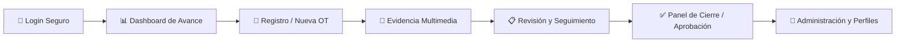

# 🌿 GreenApps — Sistema de Planificación y Gestión Urbana

[](https://nburgosfigueroa-bit.github.io/GREEN-APPS---PLANIFICADOR/)
[](https://github.com/nburgosfigueroa-bit/GREEN-APPS---PLANIFICADOR)
[](#)
[](#)

> **Contrato Operativo:** Maipú Zona 6 (AKRO)  
> **Plataforma:** Aplicación Web Integral para Gestión, Planificación y Fiscalización de Mantenimiento de Áreas Verdes e Infraestructura Urbana.

---

## 🌐 Demo en Vivo

Puedes acceder y probar la aplicación directamente desplegada en GitHub Pages:  
👉 **[https://nburgosfigueroa-bit.github.io/GREEN-APPS---PLANIFICADOR/](https://nburgosfigueroa-bit.github.io/GREEN-APPS---PLANIFICADOR/)**

---

## 📋 Descripción del Sistema

**GreenApps Planificador** es una solución web diseñada para digitalizar y optimizar el ciclo de vida de las operaciones de mantenimiento urbano y áreas verdes. Integra desde la recepción y emisión de órdenes de trabajo (OT) hasta la fiscalización, registro fotográfico georreferenciado y aprobación de cierres operativos.

### 🔄 Flujo Operativo Principal



---

## 🖥️ Módulos y Pantallas Implementadas

| Módulo | Pantalla | Descripción | Estado |
|---|---|---|:---:|
| **Acceso** | [Login Seguro](https://nburgosfigueroa-bit.github.io/GREEN-APPS---PLANIFICADOR/#login) | Autenticación con credenciales y soporte Microsoft OAuth | ✅ |
| **Acceso** | [Creación de Perfil](https://nburgosfigueroa-bit.github.io/GREEN-APPS---PLANIFICADOR/#crear-perfil) | Registro de nuevos usuarios y asignación de roles iniciales | ✅ |
| **Acceso** | [Confirmación](https://nburgosfigueroa-bit.github.io/GREEN-APPS---PLANIFICADOR/#registro-exitoso) | Pantalla de validación de registro completado | ✅ |
| **Control** | [Dashboard de Avance](https://nburgosfigueroa-bit.github.io/GREEN-APPS---PLANIFICADOR/#dashboard) | Métricas en tiempo real, KPIs operativos y estado de cuadrillas | ✅ |
| **Operación** | [Registro de Tareas](https://nburgosfigueroa-bit.github.io/GREEN-APPS---PLANIFICADOR/#tareas) | Emisión, asignación y parametrización de Órdenes de Trabajo (OT) | ✅ |
| **Multimedia** | [Galería y Reportes](https://nburgosfigueroa-bit.github.io/GREEN-APPS---PLANIFICADOR/#multimedia) | Carga de evidencias fotográficas, reportes de terreno y filtros | ✅ |
| **Fiscalización** | [Panel de Cierre](https://nburgosfigueroa-bit.github.io/GREEN-APPS---PLANIFICADOR/#cierre) | Flujo de aprobación técnica, observaciones y rechazo de trabajos | ✅ |
| **Usuario** | [Mi Perfil](https://nburgosfigueroa-bit.github.io/GREEN-APPS---PLANIFICADOR/#perfil) | Gestión de datos personales, cuadrilla y configuración | ✅ |
| **Gestión** | [Administración](https://nburgosfigueroa-bit.github.io/GREEN-APPS---PLANIFICADOR/#administracion) | Gestión global de perfiles, permisos y cuadrillas operativas | ✅ |

---

## 🛠️ Stack Tecnológico

- **Frontend Core:** HTML5 semántico + JavaScript Vanilla (Single Page Application - SPA).
- **Estilos y Diseño:** [Tailwind CSS](https://tailwindcss.com/) v3 (CDN) con tokens de diseño adaptados de Google Stitch.
- **Tipografía:** [Google Fonts](https://fonts.google.com/) (*Hanken Grotesk*, *Inter*, *JetBrains Mono*).
- **Iconografía:** [Google Material Symbols Outlined](https://fonts.google.com/icons).
- **Base de Datos & Backend:** [Supabase](https://supabase.com/) (PostgreSQL, Auth & Storage) — Esquema SQL incluido en [`greenapps/supabase_schema.sql`](./greenapps/supabase_schema.sql).

---

## 📁 Estructura del Repositorio

```text
GREEN-APPS---PLANIFICADOR/
├── index.html                                 # Enrutador principal para GitHub Pages
├── .gitignore                                 # Protección de variables y temporales
├── README.md                                  # Documentación principal
│
├── greenapps/                                 # Aplicación Web (SPA)
│   ├── index.html                             # Código de la aplicación completa
│   ├── supabase_schema.sql                    # Definición de tablas y políticas RLS
│   ├── .env.example                           # Plantilla de variables de entorno
│   ├── .gitignore                             # Ignorados específicos del módulo
│   └── README.md                              # Documentación del módulo GreenApps
│
└── stitch_gesti_n_de_mantenci_n_urbana/       # Especificaciones y Diseños Stitch
    ├── administraci_n_de_perfiles/            # UI + Captura de Administración
    ├── creaci_n_de_perfil/                    # UI + Captura de Registro
    ├── dashboard_de_avance/                   # UI + Captura de Dashboard
    ├── inicio_de_sesi_n_seguro/               # UI + Captura de Login
    ├── mi_perfil_y_gesti_n/                   # UI + Captura de Perfil
    ├── multimedia_y_reportes/                 # UI + Captura de Galería
    ├── panel_de_cierre/                       # UI + Captura de Cierre
    ├── registro_de_tareas_actualizado/        # UI + Captura de Tareas
    ├── registro_exitoso/                      # UI + Captura de Éxito
    └── urban_maintenance_greenery_system/     # Guía de Tokens y Diseño (DESIGN.md)
```

---

## 🚀 Ejecución Local

No requiere instalación de paquetes pesados ni compilación previa.

1. **Clonar el repositorio:**
   ```bash
   git clone https://github.com/nburgosfigueroa-bit/GREEN-APPS---PLANIFICADOR.git
   cd GREEN-APPS---PLANIFICADOR
   ```

2. **Abrir en el navegador:**
   - Puedes abrir directamente el archivo `index.html` o `greenapps/index.html` con doble clic, o usar una extensión como *Live Server* en VS Code.

---

## ⚙️ Activación de GitHub Pages

Para habilitar la visualización online del proyecto:

1. Ve a la pestaña **Settings** de tu repositorio en GitHub:  
   👉 [https://github.com/nburgosfigueroa-bit/GREEN-APPS---PLANIFICADOR/settings/pages](https://github.com/nburgosfigueroa-bit/GREEN-APPS---PLANIFICADOR/settings/pages)
2. En la sección **Build and deployment**:
   - **Source:** Selecciona `Deploy from a branch`.
   - **Branch:** Selecciona `main` y la carpeta `/ (root)`.
3. Haz clic en **Save**.
4. En 1 o 2 minutos tu sitio estará en vivo en:  
   👉 **[https://nburgosfigueroa-bit.github.io/GREEN-APPS---PLANIFICADOR/](https://nburgosfigueroa-bit.github.io/GREEN-APPS---PLANIFICADOR/)**

---

## 🔐 Seguridad y Variables de Entorno

- **Regla de oro:** Nunca subas claves de servicio con permisos de administración (`service_role_key`).
- El archivo `.env` se encuentra ignorado por seguridad en el `.gitignore`.
- Utiliza `.env.example` como plantilla para configurar tus credenciales locales o de conexión a Supabase.

---

## 👥 Equipo y Contacto

- **Organización:** GreenApps — Mantenimiento Urbano
- **Contrato:** Maipú Zona 6 · Empresa AKRO
- **Repositorio:** [GitHub - GREEN-APPS---PLANIFICADOR](https://github.com/nburgosfigueroa-bit/GREEN-APPS---PLANIFICADOR)
